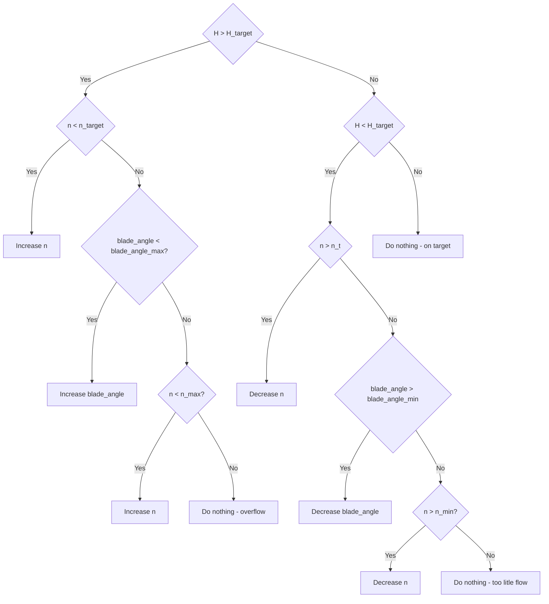

# Mermaid Diagram Example

```mermaid
graph TD
    B{H > H_target}
    B -->|Yes| C{n < n_target}
    C -->|Yes| D[Increase n]
    C -->|No| E{blade_angle < blade_angle_max?}
    E -->|Yes| F[Increase blade_angle]
    E -->|No| G{n < n_max?}
    G -->|Yes| H[Increase n]
    G -->|No| I[Do nothing - overflow]
    B -->|No| J{H < H_target}
    J -->|Yes| K{n > n_t}
    K -->|Yes| L[Decrease n]
    K -->|No| M{blade_angle > blade_angle_min}
    M -->|Yes| N[Decrease blade_angle]
    M -->|No| O{n > n_min?}
    O -->|Yes| P[Decrease n]
    O -->|No| Q[Do nothing - too litle flow]
    J -->|No| R[Do nothing - on target]    
```